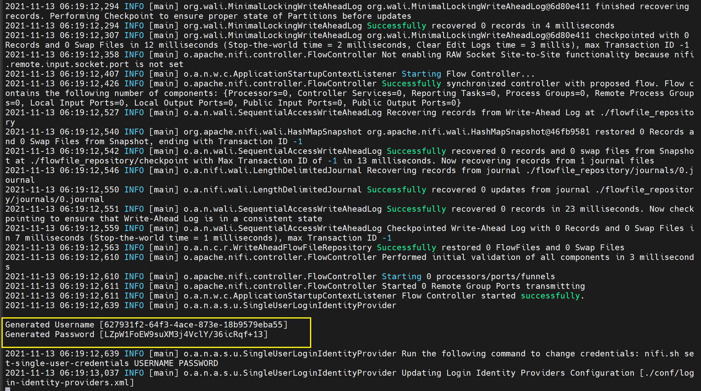
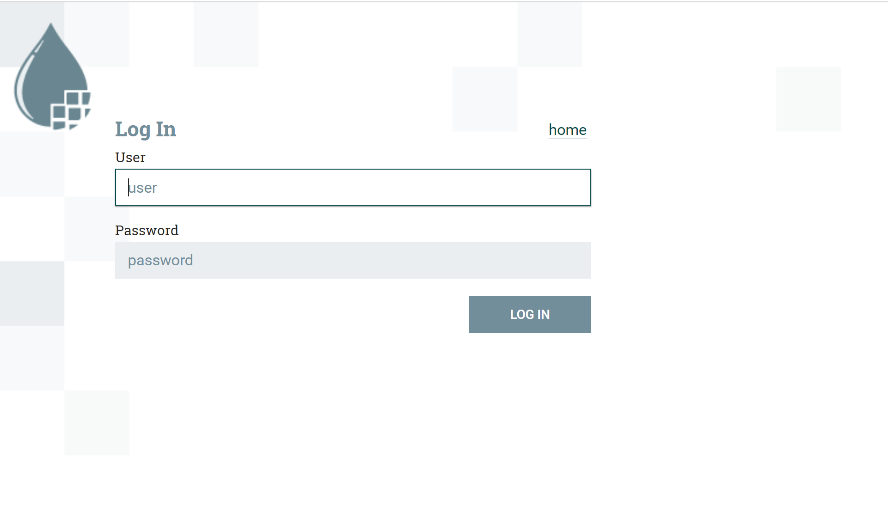
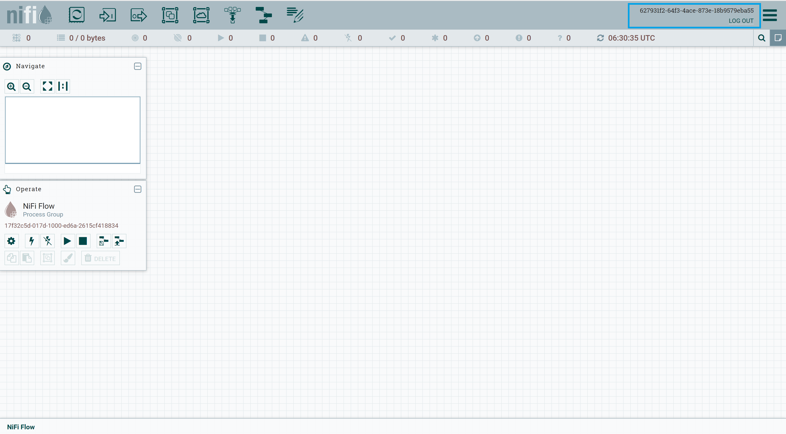

# Running NiFI securely

By default, NiFi runs securely (from 1.14.0 onwards) with single sign-on username/password credentials as authentication mechanism.

#### Download tarball from Apache NiFi site

```shell
# download apache nifi binary

# this step already done if you are using the lab
# otherwise on your local machine, you need to execute
wget https://archive.apache.org/dist/nifi/1.15.3/nifi-1.15.3-bin.tar.gz

# untar the downloaded binary
tar -zxf nifi-1.15.3-bin.tar.gz

# rename the binary to nifi
mv nifi-1.15.3 nifi

# create directory for single user auth example
mkdir single-user-auth

# move nifi to directory
mv nifi single-user-auth

# change directory
cd single-user-auth/nifi

# start nifi
./bin/nifi.sh start
```

`Note:` We are not required to make any nifi.properties changes as it is auto-fills required properties to run as HTTPS

#### Get username/password credentials

When to tail `nifi-app.log` file, you will see randomly generated credentials which you need to use while logging into NiFi

```shell
tail -f ./logs/nifi-app.log

# username/password
# Generated Username [627931f2-64f3-4ace-873e-18b9579eba55]
# Generated Password [LZpW1FoEW9suXM3j4VclY/36icRqf+13]
```



#### Navigate to canvas

`https://<ip-address>:8443/nifi`

Enter username/password credentials and get into canvas






**Note :** If you would like to override the auto generated username/password, then execute below command

```shell
# inside single-user-auth directory

# change directory to nifi/bin
cd nifi/bin

# Replace USERNAME and PASSWORD
./nifi.sh set-single-user-credentials USERNAME PASSWORD
```